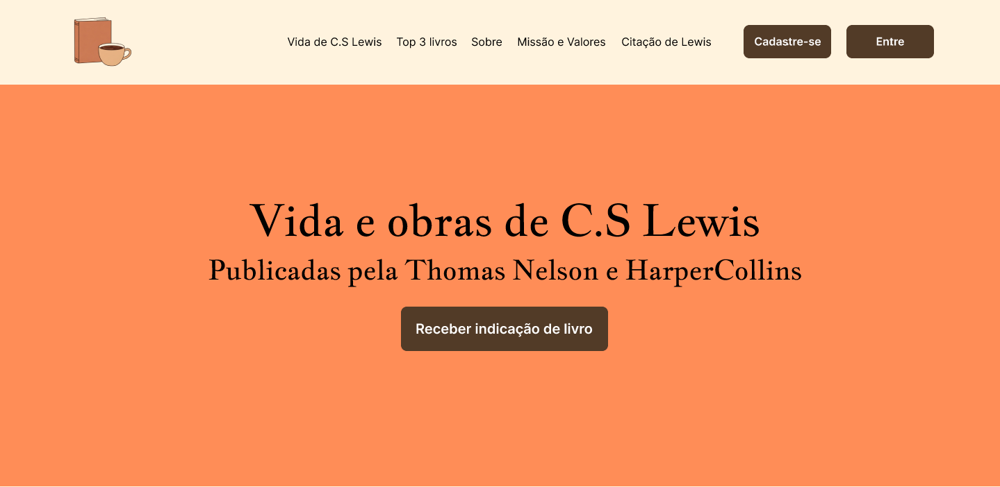
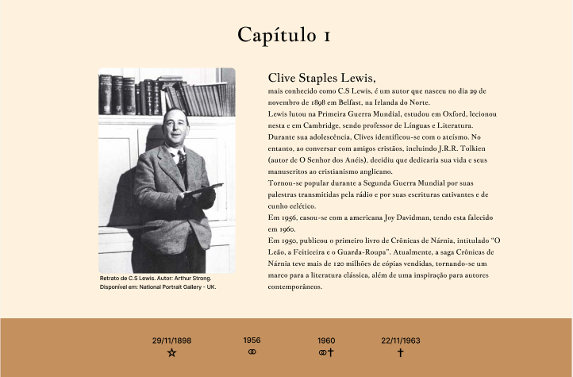
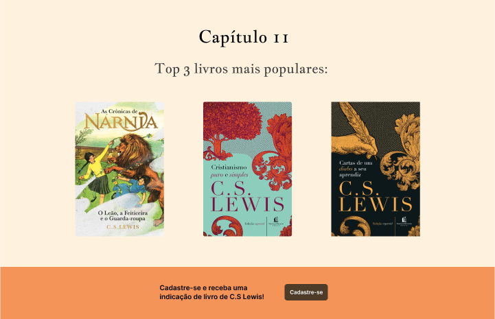
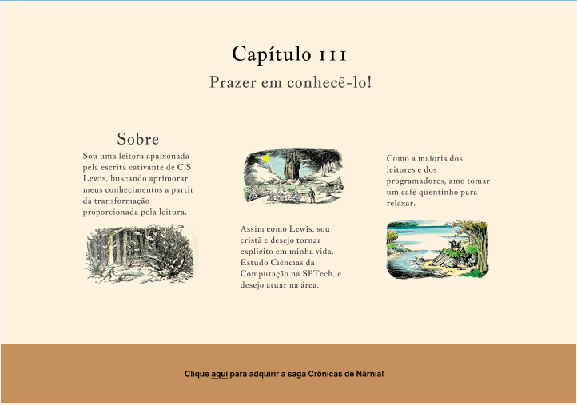
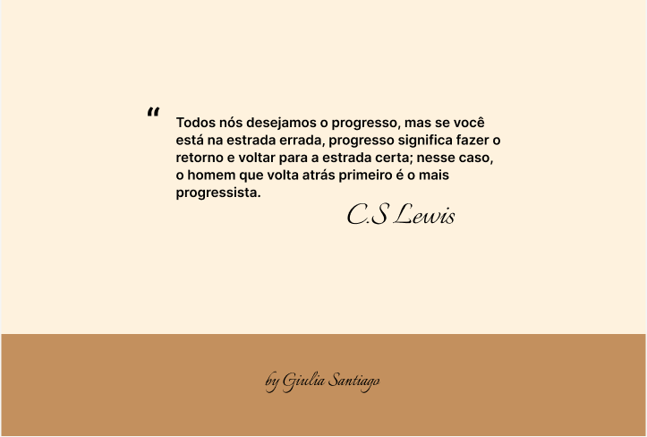
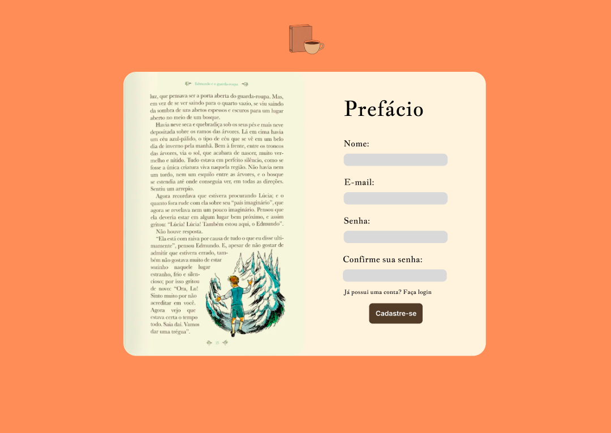
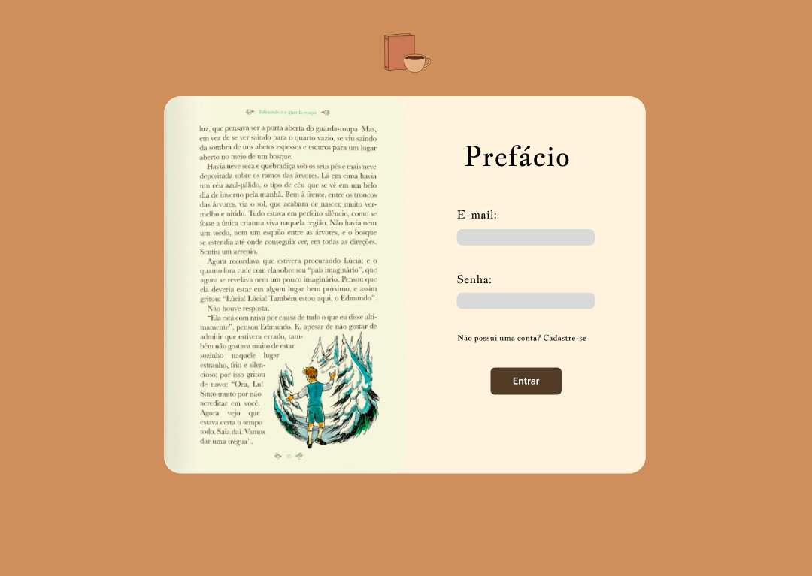
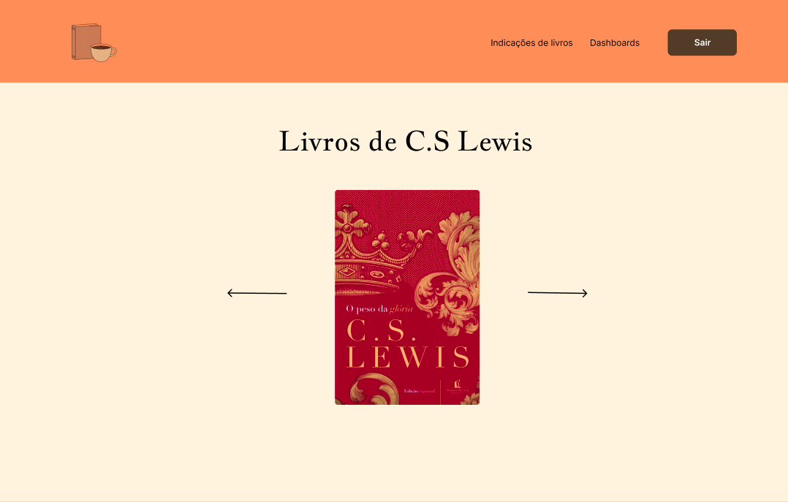

# C.S Lewis

Projeto individual sobre a vida e obras do renomado autor irlandês Clive Staples Lewis, mais conhecido como C.S Lewis.

## Objetivos do Projeto
- [x] Trazer informações sobre a vida de C.S Lewis
- [x] Incluir página de cadastro e login
- [x] Incluir página de dashboards, com gráficos comparativos e KPI's de livros lidos
- [x] Realizar sorteio de próxima leitura

## Protótipo do website (Figma)
- Página Inicial

- Vida do autor

- Top 3 livros mais populares

- Sobre

- Missão e Valores

- Citação de Lewis

- Página de cadastro

- Página de login

- Carroussel de livros

