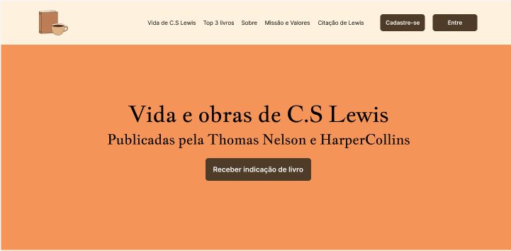
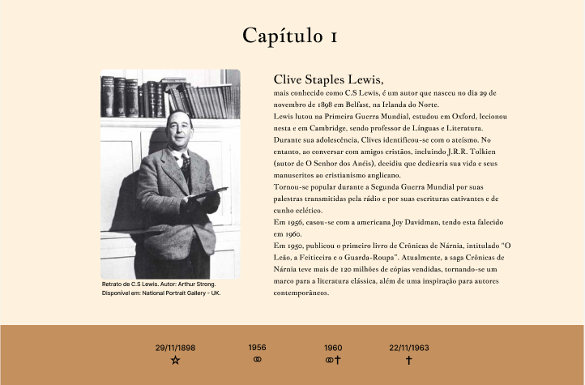
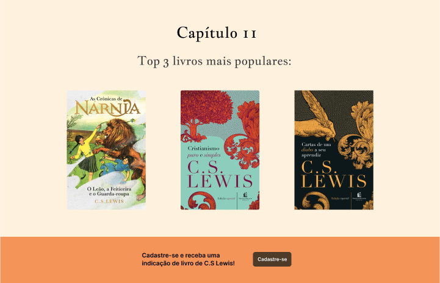
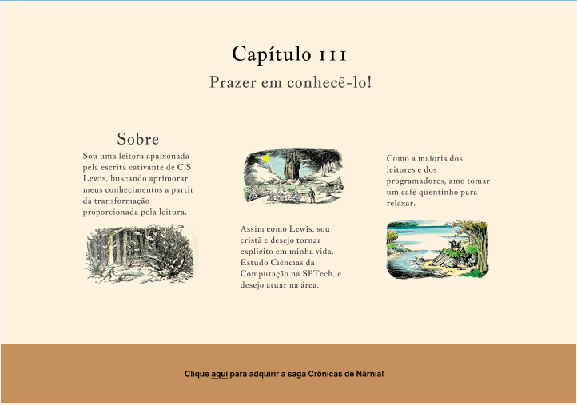
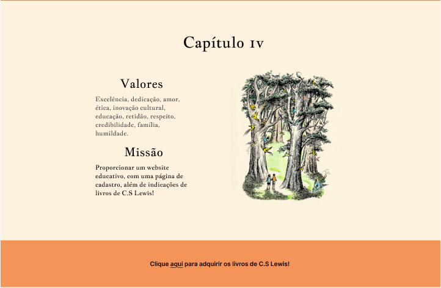
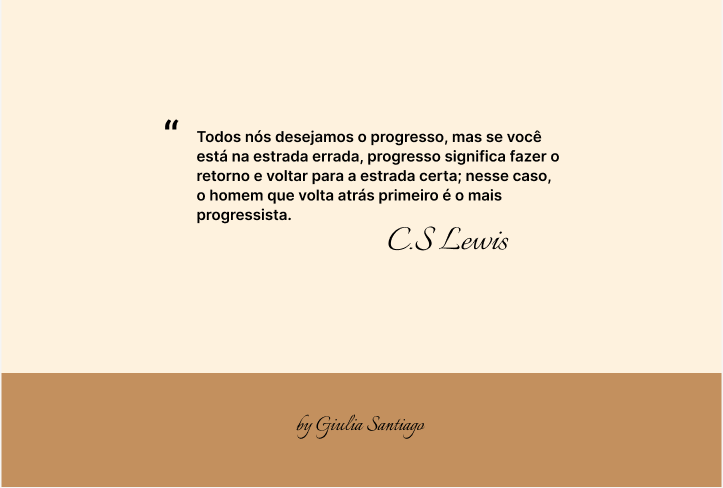

# C.S Lewis

Projeto individual sobre a vida e obras do renomado autor C.S Lewis

## Objetivos do Projeto
- [x] Trazer informações sobre a vida de C.S Lewis
- [x] Indicar obras de Lewis publicadas pela HarperCollins e Thomas Nelson
- [x] Incluir página de cadastro e login
- [x] Dashboards

## Protótipo do website
- Página Inicial

- Vida do autor

- Top 3 livros mais populares

- Sobre

- Missão e Valores

- Citação de Lewis

